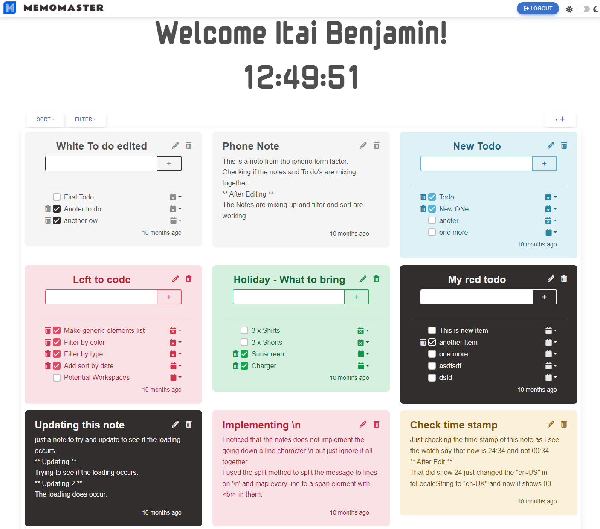
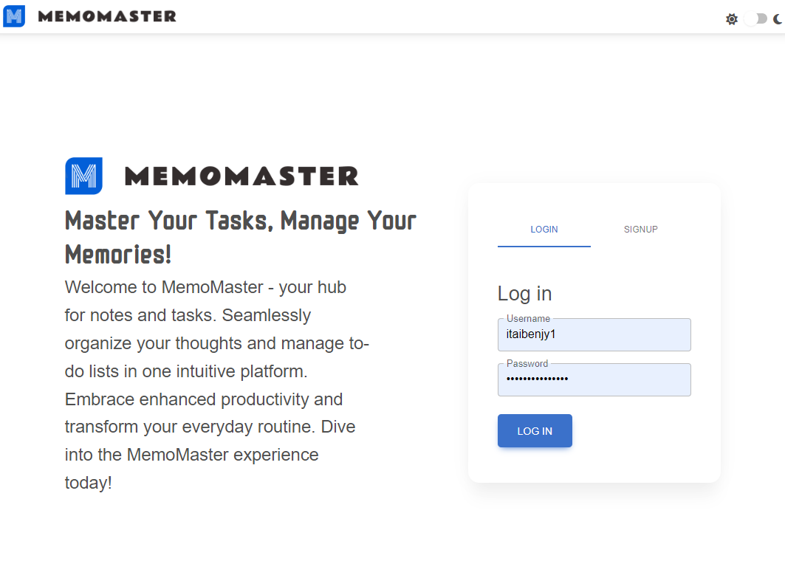
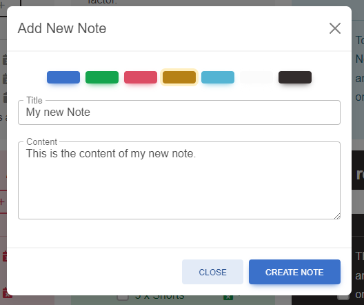
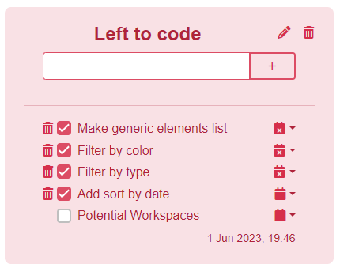
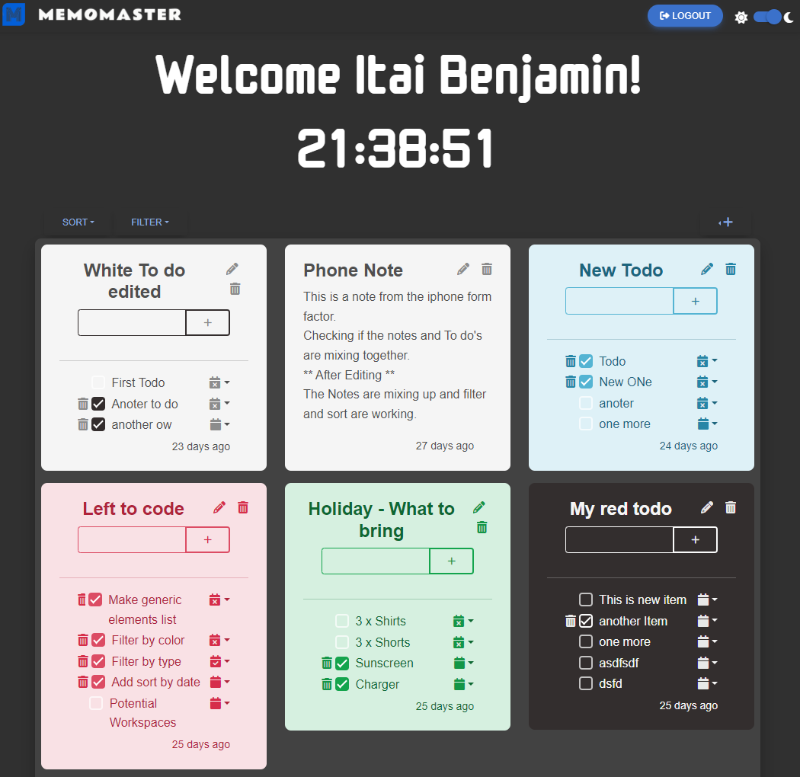
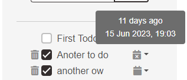
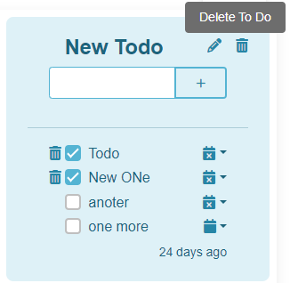
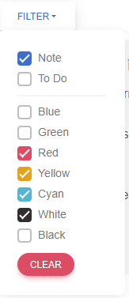

# Memo Master

Memo Master is a comprehensive, full-stack web application built with MongoDB, Express, React, and Node.js (MERN). This dynamic application is equipped with JWT (JSON Web Tokens) and bcrypt for enhanced data security and robust user authentication. Memo Master simplifies and enhances task management and note-taking, providing users with a multitude of functionalities designed for efficiency and convenience. Coupled with a user-friendly interface and dark mode, Memo Master creates an engaging user experience.

## Features

- **User Authentication**: Memo Master has implemented a secured user login and signup process using bcrypt hashing and JWT. This protects user data, ensuring it is securely stored and transmitted.

  

- **Note-taking**: Memo Master provides an intuitive interface for users to jot down notes. Users can customize the color of their notes, offering a visual means to categorize and differentiate notes at a glance.

  

- **Todo Lists**: Users can create and manage todo lists. Each list can be named and customized with unique items. The application allows easy tracking and updating of lists for improved task management.

  

- **Todo List Items**: Each item in the todo list can be assigned a specific date and time. This feature assists with scheduling and reminds users of important tasks or deadlines.

- **Dark Mode**: For those who prefer a darker theme for their applications, Memo Master includes a dark mode. This eye-friendly alternative can be toggled on or off, providing an aesthetically pleasing experience that reduces eye strain in low-light conditions.

  

- **Tooltip Assistance**: To assist users, tooltips have been included throughout the application. These help explain the purpose and functionality of various buttons and inputs, making the application more accessible and easier to navigate.

  
  

- **Sorting and Filtering**: Memo Master includes sorting and filtering capabilities. Users can sort notes and todo lists from new to old or vice versa, making it easier to find specific notes or tasks. Users can also filter notes by color or type, streamlining the process of locating relevant information.

  
  

- **Delete Confirmation**: To prevent accidental data loss, Memo Master asks users for confirmation before deleting any list.

  

## Live Deploy

Memo Master is deployed and live. You can access it [here](https://memomaster.vercel.app/). 

## Tech Stack

- Front-end: React.js
- Back-end: Node.js, Express.js
- Database: MongoDB
- Authentication: JWT, bcrypt
- Styling: CSS, MDBootstrap, Ant Design

## Future Improvements

- Implement real-time collaboration.
- Add text formatting options to the notes.
- Integrate with third-party apps like Google Calendar.
- Create a mobile app for Memo Master.
